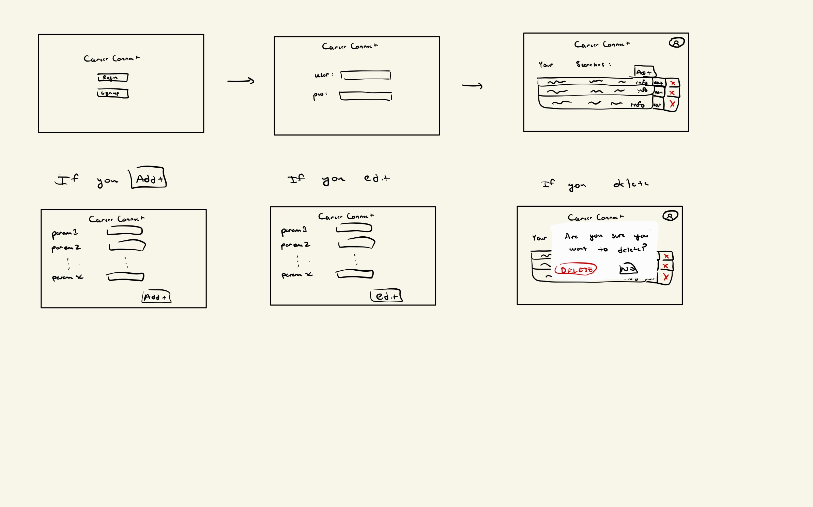

# Project Title: CareerConnect

## Project Summary

Finding classes is already a difficult task, especially when coupled with a career search. We aim to make that easier by combining both searches into one convenient service. With a dataset of 2023's LinkedIn job postings, we aim to allow users to filter job postings by multiple criteria - such as location, minimum pay, job title, skills required, etc. - and rank them by company reviews, and with the resulting set of job postings, build a custom class schedule that best supports these jobs. We not only facilitate each individual search but help optimize both in a way that they support each other. Through our application, the user will be able to curate a set of courses that will fully prepare them for their desired career, and understand which companies and roles appeal to them the most.

## Description of the Application

We want our application to assist university students in choosing classes that will help them be prepared for the career they choose when they finish university. Our application will utilize three datasets and user input to come up with a curriculum for users. Jobs will get suggested to a user based on their input. Users can click on each job they are interested in and a curriculum based on each job will be presented. Users can make up their mind on which classes they could be interested in and also know more about the topics they will learn about throughout their university experience in relation to their career path.

## Creative Component

The technically challenging function that will improve the functionality of our application will be an NLP, which will help us match job descriptions to course descriptions, and will rank their similarity based on the content of each. Natural Language Processing (NLP) is a subset of machine learning that allows computers to understand human language and text. We plan to use several pre-trained models from Hugging Face, and experiment to determine which of these produces the best results. We also may modify the models to improve performance.

## Usefulness

The chosen application will allow users to input preferences such as desired salary, benefits, etc. and they will get suggested careers based on their preferences. From there, the user will be able to see a curriculum that can help them be prepared to get into the career they want from the suggested list. This gives users an idea of what their classes could look like based on the career they want. There are websites like LinkedIn and Indeed that help users find jobs but do not suggest what classes a user could take that are related to that field. The application chosen is more targeted towards university students and helps them plan out their curriculum and take the necessary courses to prosper into the career of their choosing.

## Realness

Three datasets were chosen to create the application: [LinkedIn Jobs Posting](https://www.kaggle.com/datasets/arshkon/linkedin-job-postings/data?select=job_postings.csv), [Company Reviews](https://www.kaggle.com/datasets/vaghefi/company-reviews), and [UIUC Courses](https://github.com/wadefagen/datasets/blob/master/course-catalog/data/2023-sp.csv). The first two data sets are reliable .csv files from Kaggle, and the third data source was created by Professor Wade Fagen-Ulmschneider. The LinkedIn Jobs Posting dataset contains 33000+ postings, each with 27 attributes. The Company Reviews dataset contains 17000+ reviews, each with 20 attributes. Finally, the UIUC Courses dataset contains ~12000 classes from Spring 2023, each with 26 attributes.

```bash
https://drive.google.com/file/d/1bektQwbYrLrTcKwygMQGKgr76pCXqEn-/view?usp=sharing
```

## Functionality

The front-end allows users to interface with the application by entering parameters and receiving a list of necessary courses to take to reach their career goals. The user can create a “search,” which includes parameters such as location, salary, keywords, etc. The user can read the output of the search, which includes a list of classes that would allow them to reach their desired career/job. The user can update their existing searches, and delete their existing searches.

## Low-Fidelity UI Mockup



## Project Work Distribution

### Rafael (rafaelp5):
- Create DB and add different DB functionality (queries, procedures, triggers, etc)
- Work on the backend of the project
- The logic behind matching job postings to courses by their description: an initial MVP could be simple string matching, with more complex and effective NLP techniques to follow (in conjunction with Jack)

### Areet (assheth2):
- Create DB and add different DB functionality (queries, procedures, triggers, etc)
- Front-end implementation
- API implementation (CRUD)
- Learn about and add thoughts on NLP

### Diego (ddelca3):
- Create DB and add different DB functionality (queries, procedures, triggers, etc)
- Learn about NLP and provide input when necessary
- Front-end implementation

### Jack (jdmason2):
- Create DB and add different DB functionality (queries, procedures, triggers, etc)
- Test NLP and evaluate model performance
- Integrate NLP into DB via backend
- Learn about transformer models
- General backend assistance, when necessary / overloaded
