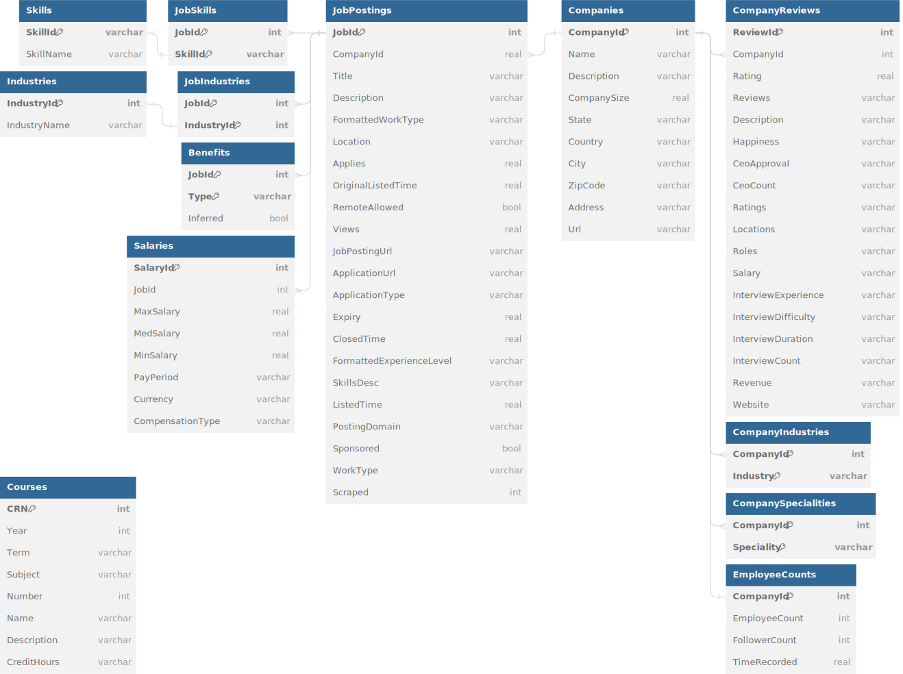

# Stage 2: Database Design

## UML Database Design

*https://dbdiagram.io/d/CS411_TopDB-65d6321c783e8c6ca51a5b4d*

## Data sources and rationale

As mentioned in the [Project Proposal](Stage1_ProjectProposal.md), we obtained three datasets that will be the basis for our applications:
1.  [UIUC Courses](https://github.com/wadefagen/datasets/blob/master/course-catalog/data/2023-sp.csv)
    
    The first dataset (`Courses` on the diagram, bottom left) consists of a single table, with the basic course information for all courses offered in the Spring 2023 semester. It originally also contained much more data (like section information, degree requirements, etc), but we are only keeping the relevant fields for matching a selection of job postings to supporting course suggestions, and we can always link the up-to-date [Course Explorer page](http://go.illinois.edu/courseexplorer/) with the information we have kept from each course. It does not have any relationships with any other tables on purpose: this is where the NLP techniques we have mentioned in our [Project Proposal](Stage1_ProjectProposal.md) will come in to dynamically match a set of `JobPostings` with a set of `Courses` - the best courses in support of a certain career path.

2.  [Company Reviews](https://www.kaggle.com/datasets/vaghefi/company-reviews)
   
    The second dataset (`CompanyReviews` on the diagram, top right) also consists of a single table. As per the original dataset, many of its columns (such as `Happiness`) contain a dictionary of a variety of metrics. For simplicity's sake, instead of making a separate table for each of those, or creating dozens of new fields, we will aggregate those into a single numeric metric for each of the columns in the present diagram. We will then match each review to the corresponding company ID in the Job Postings dataset, thus augmenting our main source of data. Since each company can potentially have many review data points, we have a one-to-many relationship between `Companies.CompanyId < CompanyReviews.CompanyId`, as shown in the diagram.

3.  [LinkedIn Jobs Posting](https://www.kaggle.com/datasets/arshkon/linkedin-job-postings/data?select=job_postings.csv)
  
    Finally, our third and largest dataset is the `JobPostings` dataset. It consists originally of 11 tables (all the remaining tables not mentioned above). The two main entities are `JobPostings` and `Companies`. Each `JobPosting` pertains to a single company, but each company can have multiple job postings (thus, another one-to-many relation between `JobPostings.CompanyId > Companies.CopanyId`). 

    For each `JobPosting`, it can have any number of `JobSkills`, `JobIndustries`, `Benefits`, and `Salaries`. Since each `JobPosting` can have any number of `JobSkills`, the primary key arrangement shown in the diagram is necessary to uniquely identify a row in `JobSkills`. And likewise for `JobIndustries`. They each keep an abbreviated, unique name for their respective skill/industry, with the full name kept separate in another entity for brevity. These naturally have a one-to-one relation on their abbreviations (`JobSkills.SkillId - Skills.SkillId` and `JobIndustries.IndustryId - Industries.IndustryId`).

    Then, for each `Company`, we can have any number of `CompanyIndustries` and `CompanySpecialties` (much like the job skills and job industries discussed above). Each company has only one `EmployeeCount`. Finally, each company can have many `CompanyReviews`, which once again we have joined from another dataset to augment our job search data and allow for better ranking for our users' job searches.

*Note: when referring to relationships, we'll be using `-` to mean one-to-one, and `<` or `>` to refer to one-to-many or many-to-one, respectively. On the diagram, a perpendicular dash over the relationship line means one, and a three-way-branch means many.*

## Normalization

Now that we have the database design, let us consider the logical design and potential normalization. 

First, let us identify the Functional Dependencies of our data, organized here by each table in the diagram. For brevity, we'll only include the table name prefix when referring to another table.

1. `JobPostings`
    1. `JobId --> CompanyId, Title, Description, FormattedWorkType, Location, Applies, OriginalListedTime, RemoteAllowed, Views, JobPostingUrl, ApplicationUrl, ApplicationType, Expiry, ClosedTime, FormattedExperienceLevel, SkillsDesc, ListedTime, PostingDomain, Sponsored, WorkType, Scraped`
    2. `CompanyId --> Companies.CompanyId`
2. `JobSkills`
    1. `JobId --> JobPostings.JobId`
    2. `SkillId --> Skills.SkillId`
3. `Skills`
    1. `SkillId --> SkillName`
4. `JobIndustries`
    1. `JobId --> JobPostings.JobId`
    2. `IndustryId --> Industries.IndustryId`
5. `Industries`
    1. `IndustryId --> IndustryName`
6. `Benefits`
    1. `JobId, Type --> Inferred`
    2. `JobId --> JobPostings.JobId`
7. `Salaries`
    1. `SalaryId --> JobId, MaxSalary, MedSalary, MinSalary, PayPeriod, Currency, CompensationType`
    2. `JobId --> JobPostings.JobId`
8.  `Companies`
    1.  `CompanyId --> Name, Description, CompanySize, State, Country, City, ZipCode, Address, Url`
9. `CompanyIndustries`
    1.  `CompanyId --> Companies.CompanyId`
10. `CompanySpecialties`
    1.  `CompanyId --> Companies.CompanyId`
11. `EmployeeCounts`
    1.  `CompanyId --> EmployeeCount, FollowerCount, TimeRecorded`
    2.  `CompanyId --> Companies.CompanyId`
12. `CompanyReview`
    1.  `ReviewId --> CompanyId, Rating, Reviews, Description, Happiness, CeoApproval, CeoCount, Ratings, Locations, Roles, Salary, InterviewExperience, InterviewDifficulty, InterviewDuration, InterviewCount, Revenue, Website`
    2.  `CompanyId --> Companies.CompanyId`
13. `Courses`
    1.  `CRN --> Year, Term, Subject, Number, Name, Description, CreditHours`

Then, from the definition of the *BCNF*:

> A relational schema **R** is in Boyce–Codd normal form if and only if for every one of its dependencies $X \rightarrow Y$, at least one of the following conditions hold:
> * $X \rightarrow Y$ is a trivial functional dependency ($Y \subseteq X$),
> * $X$ is a superkey for schema **R**

*[Source](https://en.wikipedia.org/wiki/Boyce%E2%80%93Codd_normal_form#)*

From our list above, we can easily see that for every FD that is exclusive to its own table **R** (i.e, not counting the FDs that represent inter-table relations, such as `JobPostingsCompanyId --> Companies.CompanyId`), we indeed have that every left-hand-side of every nontrivial FD is a superkey for **R**, as they are all defined by their original table's primary key -- which, by definition, must uniquely identify each row. Therefore, our datasets were already normalized and require no further normalization to conform to *BCNF* (and *3NF*, by extension), and thus, we're keeping it in *BCNF* format.

## Logical Design

Therefore, having all the information described above, our final Relational Schema is as follows:

    Courses (
        CRN: INT [PK],
        Year: INT,
        Term: VARCHAR(255),
        Subject: VARCHAR(255),
        Number: INT,
        Name: VARCHAR(255),
        Description: VARCHAR(255),
        CreditHours: VARCHAR(255)
    )

    CompanyReviews (
        ReviewId: INT [PK],
        CompanyId: INT [FK to Companies.CompanyId],
        Rating: REAL,
        Reviews: VARCHAR(255),
        Description: VARCHAR(255),
        Happiness: VARCHAR(255),
        CeoApproval: VARCHAR(255),
        CeoCount: VARCHAR(255),
        Ratings: VARCHAR(255),
        Locations: VARCHAR(255),
        Roles: VARCHAR(255),
        Salary: VARCHAR(255),
        InterviewExperience: VARCHAR(255),
        InterviewDifficulty: VARCHAR(255),
        InterviewDuration: VARCHAR(255),
        InterviewCount: VARCHAR(255),
        Revenue: VARCHAR(255),
        Website: VARCHAR(255)
    )

    JobPostings (
        JobId: INT [PK],
        CompanyId: REAL [FK to Companies.CompanyId],
        Title: VARCHAR(255),
        Description: VARCHAR(255),
        FormattedWorkType: VARCHAR(255),
        Location: VARCHAR(255),
        Applies: REAL,
        OriginalListedTime: REAL,
        RemoteAllowed: BOOL,
        Views: REAL,
        JobPostingUrl: VARCHAR(255),
        ApplicationUrl: VARCHAR(255),
        ApplicationType: VARCHAR(255),
        Expiry: REAL,
        ClosedTime: REAL,
        FormattedExperienceLevel: VARCHAR(255),
        SkillsDesc: VARCHAR(255),
        ListedTime: REAL,
        PostingDomain: VARCHAR(255),
        Sponsored: BOOL,
        WorkType: VARCHAR(255),
        Scraped: INT
    )

    Skills (
        SkillId: VARCHAR(255) [PK],
        SkillName: VARCHAR(255)
    )

    Industries (
        IndustryId: INT [PK],
        IndustryName: VARCHAR(255)
    )

    CompanyIndustries (
        CompanyId: INT [PK, FK to Companies.CompanyId],
        Industry: VARCHAR(255) [PK]
    )

    CompanySpecialities (
        CompanyId: INT [PK, FK to Companies.CompanyId],
        Speciality: VARCHAR(255) [PK]
    )

    Companies (
        CompanyId: INT [PK],
        Name: VARCHAR(255),
        Description: VARCHAR(255),
        CompanySize: REAL,
        State: VARCHAR(255),
        Country: VARCHAR(255),
        City: VARCHAR(255),
        ZipCode: VARCHAR(255),
        Address: VARCHAR(255),
        Url: VARCHAR(255)
    )

    EmployeeCounts (
        CompanyId: INT [PK, FK to Companies.CompanyId],
        EmployeeCount: INT,
        FollowerCount: INT,
        TimeRecorded: REAL
    )

    Benefits (
        JobId: INT [PK, FK to JobPostings.JobId],
        Type: VARCHAR(255) [PK],
        Inferred: BOOL
    )

    Salaries (
        SalaryId: INT [PK],
        JobId: INT [FK to JobPostings.JobId],
        MaxSalary: REAL,
        MedSalary: REAL,
        MinSalary: REAL,
        PayPeriod: VARCHAR(255),
        Currency: VARCHAR(255),
        CompensationType: VARCHAR(255)
    )

    JobIndustries (
        JobId: INT [PK, FK to JobPostings.JobId],
        IndustryId: INT [PK, FK to Industries.IndustryId]
    )

    JobSkills (
        JobId: INT [PK, FK to JobPostings.JobId],
        SkillId: VARCHAR(255) [PK, FK to Skills.SkillId]
    )

