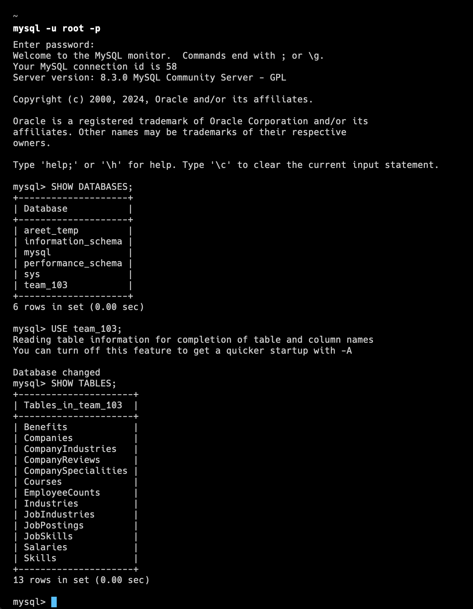
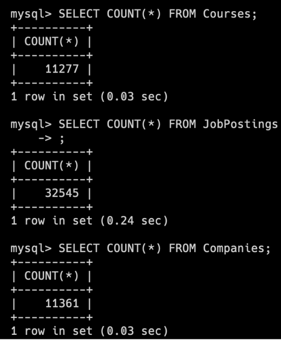
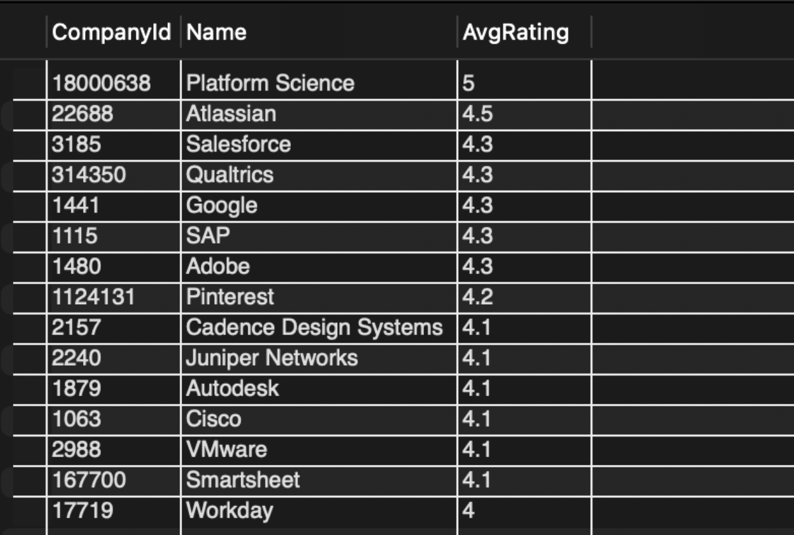
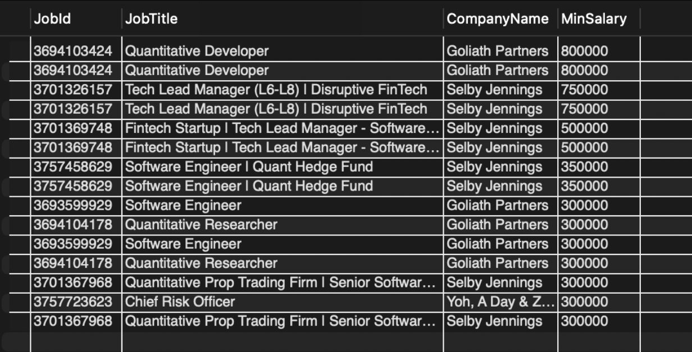
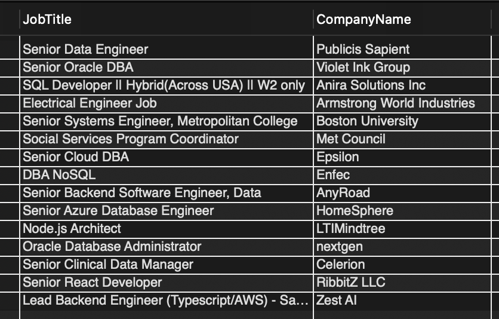
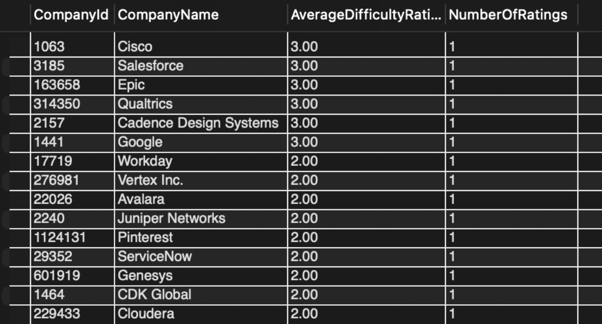

# Stage 3: MySQL Database Design 

## Database implementation

### Proof of connection

We implemented the database locally on MySQL. 



### DDL Commmands

```sql
CREATE TABLE Industries (
    IndustryId INT PRIMARY KEY,
    IndustryName VARCHAR(255)
);

CREATE TABLE Skills (
    SkillId VARCHAR(255) PRIMARY KEY,
    SkillName VARCHAR(255)
);

CREATE TABLE Companies (
    CompanyId INT PRIMARY KEY,
    Name VARCHAR(255),
    Description VARCHAR(255),
    CompanySize FLOAT,
    State VARCHAR(255),
    Country VARCHAR(255),
    City VARCHAR(255),
    ZipCode VARCHAR(255),
    Address VARCHAR(255),
    Url VARCHAR(255)
);

CREATE TABLE Courses (
    CRN INT PRIMARY KEY,
    Year INT,
    Term VARCHAR(255),
    Subject VARCHAR(255),
    Number INT,
    Name VARCHAR(255),
    Description VARCHAR(255),
    CreditHours VARCHAR(255)
);

CREATE TABLE CompanyReviews (
    ReviewId INT PRIMARY KEY,
    CompanyId INT,
    Rating FLOAT,
    Reviews VARCHAR(255),
    Description VARCHAR(255),
    Happiness VARCHAR(255),
    CeoApproval VARCHAR(255),
    CeoCount VARCHAR(255),
    Ratings VARCHAR(255),
    Locations VARCHAR(255),
    Roles VARCHAR(255),
    Salary VARCHAR(255),
    InterviewExperience VARCHAR(255),
    InterviewDifficulty VARCHAR(255),
    InterviewDuration VARCHAR(255),
    InterviewCount VARCHAR(255),
    Revenue VARCHAR(255),
    Website VARCHAR(255),
    FOREIGN KEY (CompanyId) REFERENCES Companies(CompanyId)
);

CREATE TABLE JobPostings (
    JobId INT PRIMARY KEY,
    CompanyId INT,
    Title VARCHAR(255),
    Description VARCHAR(255),
    FormattedWorkType VARCHAR(255),
    Location VARCHAR(255),
    Applies FLOAT,
    OriginalListedTime FLOAT,
    RemoteAllowed BOOLEAN,
    Views FLOAT,
    JobPostingUrl VARCHAR(255),
    ApplicationUrl VARCHAR(255),
    ApplicationType VARCHAR(255),
    Expiry FLOAT,
    ClosedTime FLOAT,
    FormattedExperienceLevel VARCHAR(255),
    SkillsDesc VARCHAR(255),
    ListedTime FLOAT,
    PostingDomain VARCHAR(255),
    Sponsored BOOLEAN,
    WorkType VARCHAR(255),
    Scraped INT,
    FOREIGN KEY (CompanyId) REFERENCES Companies(CompanyId)
);

CREATE TABLE CompanyIndustries (
    CompanyId INT,
    Industry VARCHAR(255),
    PRIMARY KEY (CompanyId, Industry),
    FOREIGN KEY (CompanyId) REFERENCES Companies(CompanyId)
);

CREATE TABLE CompanySpecialities (
    CompanyId INT,
    Speciality VARCHAR(255),
    PRIMARY KEY (CompanyId, Speciality),
    FOREIGN KEY (CompanyId) REFERENCES Companies(CompanyId)
);

CREATE TABLE EmployeeCounts (
    CompanyId INT,
    EmployeeCount INT,
    FollowerCount INT,
    TimeRecorded FLOAT,
    PRIMARY KEY (CompanyId),
    FOREIGN KEY (CompanyId) REFERENCES Companies(CompanyId)
);

CREATE TABLE Benefits (
    JobId INT,
    Type VARCHAR(255),
    Inferred BOOLEAN,
    PRIMARY KEY (JobId, Type),
    FOREIGN KEY (JobId) REFERENCES JobPostings(JobId)
);

CREATE TABLE Salaries (
    SalaryId INT PRIMARY KEY,
    JobId INT,
    MaxSalary FLOAT,
    MedSalary FLOAT,
    MinSalary FLOAT,
    PayPeriod VARCHAR(255),
    Currency VARCHAR(255),
    CompensationType VARCHAR(255),
    FOREIGN KEY (JobId) REFERENCES JobPostings(JobId)
);

CREATE TABLE JobIndustries (
    JobId INT,
    IndustryId INT,
    PRIMARY KEY (JobId, IndustryId),
    FOREIGN KEY (JobId) REFERENCES JobPostings(JobId),
    FOREIGN KEY (IndustryId) REFERENCES Industries(IndustryId)
);

CREATE TABLE JobSkills (
    JobId INT,
    SkillId VARCHAR(255),
    PRIMARY KEY (JobId, SkillId),
    FOREIGN KEY (JobId) REFERENCES JobPostings(JobId),
    FOREIGN KEY (SkillId) REFERENCES Skills(SkillId)
);
```
### Database Insertions

We have 13 tables, each of which has many inserted rows. Here is an image showing the number of rows of the 3 largest tables:



## Advanced Queries

### Query 1
```sql
USE team_103;

SELECT 
    c.CompanyId,
    c.Name,
    AVG(cr.Rating) AS AvgRating
FROM 
    Companies c
JOIN 
    CompanyReviews cr ON c.CompanyId = cr.CompanyId
JOIN 
    CompanyIndustries ci ON c.CompanyId = ci.CompanyId
WHERE 
    ci.Industry LIKE '%software%' 
GROUP BY 
    c.CompanyId, c.Name
ORDER BY 
    AvgRating DESC
LIMIT 15;
```


### Query 2
```sql
USE team_103;

SELECT jp.JobId, jp.Title AS JobTitle, c.Name AS CompanyName, s.MinSalary
FROM (
    SELECT JobId
    FROM Salaries
    WHERE MinSalary > 100000 -- Change with desired min
) AS SalaryJobs

JOIN (
    SELECT js.JobId
    FROM JobSkills js
    JOIN Skills s ON js.SkillId = s.SkillId
    WHERE s.SkillName IN ('engineering', 'finance') -- Specify the skills you're interested in
) AS SkillJobs ON SalaryJobs.JobId = SkillJobs.JobId

JOIN JobPostings jp ON SalaryJobs.JobId = jp.JobId
JOIN Companies c ON jp.CompanyId = c.CompanyId
JOIN Salaries s ON jp.JobId = s.JobId
ORDER BY s.MinSalary DESC
LIMIT 15;

```


### Query 3
```sql
USE team_103;

SELECT DISTINCT jp.Title AS JobTitle, com.Name AS CompanyName
FROM JobPostings jp
JOIN Companies com ON jp.CompanyId = com.CompanyId
JOIN (
    SELECT jp.JobId
    FROM JobPostings jp
    JOIN Courses c ON jp.Description LIKE CONCAT('%', c.Name, '%')
    WHERE c.Subject = 'CS' AND c.Number = 411 -- Specify the course subject and number
    GROUP BY jp.JobId
) AS subquery ON jp.JobId = subquery.JobId
LIMIT 15;

```


### Query 4
```sql
USE team_103;

SELECT 
    cr.CompanyId,
    com.Name AS CompanyName,
    ROUND(AVG(CASE cr.InterviewDifficulty
            WHEN 'Easy' THEN 1
            WHEN 'Medium' THEN 2
            WHEN 'Difficult' THEN 3
            ELSE 0
        END) / COUNT(cr.InterviewDifficulty) * 1.0, 2) AS AverageDifficultyRating,
	COUNT(cr.InterviewDifficulty) AS NumberOfRatings
FROM 
    CompanyReviews cr
JOIN 
    CompanyIndustries ci ON cr.CompanyId = ci.CompanyId
JOIN 
    Companies com ON cr.CompanyId = com.CompanyId
WHERE 
    ci.Industry = 'softwaredevelopment' -- Specify the industry you're interested in
GROUP BY 
    cr.CompanyId, com.Name
ORDER BY 
    AverageDifficultyRating DESC
LIMIT 15;

```


## Indexing Analysis
For each of the queries below, we try different index permutations, and analyze the most optimal. 

### Query 1

**No Indexes:**

'-> Sort: AvgRating DESC  (actual time=7.47..7.48 rows=54 loops=1)\n    -> Table scan on <temporary>  (actual time=7.32..7.34 rows=54 loops=1)\n        -> Aggregate using temporary table  (actual time=7.32..7.32 rows=54 loops=1)\n            -> Nested loop inner join  (cost=705 rows=154) (actual time=0.66..7.19 rows=76 loops=1)\n                -> Nested loop inner join  (cost=641 rows=154) (actual time=0.598..6.38 rows=76 loops=1)\n                    -> Filter: (cr.CompanyId is not null)  (cost=180 rows=1239) (actual time=0.209..1.82 rows=1372 loops=1)\n                        -> Table scan on cr  (cost=180 rows=1239) (actual time=0.208..1.75 rows=1372 loops=1)\n                    -> Filter: (ci.Industry like \'%software%\')  (cost=0.26 rows=0.124) (actual time=0.00322..0.00325 rows=0.0554 loops=1372)\n                        -> Covering index lookup on ci using PRIMARY (CompanyId=cr.CompanyId)  (cost=0.26 rows=1.12) (actual time=0.00241..0.00289 rows=1.21 loops=1372)\n                -> Single-row index lookup on c using PRIMARY (CompanyId=cr.CompanyId)  (cost=0.32 rows=1) (actual time=0.0104..0.0104 rows=1 loops=76)\n'

**CREATE INDEX idx_CompanyReviews_CompanyId ON CompanyReviews (CompanyId);**

'-> Sort: AvgRating DESC  (actual time=5.69..5.69 rows=54 loops=1)\n    -> Table scan on <temporary>  (actual time=5.66..5.66 rows=54 loops=1)\n        -> Aggregate using temporary table  (actual time=5.65..5.65 rows=54 loops=1)\n            -> Nested loop inner join  (cost=705 rows=154) (actual time=0.3..5.53 rows=76 loops=1)\n                -> Nested loop inner join  (cost=641 rows=154) (actual time=0.293..5.33 rows=76 loops=1)\n                    -> Filter: (cr.CompanyId is not null)  (cost=180 rows=1239) (actual time=0.145..1.09 rows=1372 loops=1)\n                        -> Table scan on cr  (cost=180 rows=1239) (actual time=0.144..0.995 rows=1372 loops=1)\n                    -> Filter: (ci.Industry like \'%software%\')  (cost=0.26 rows=0.124) (actual time=0.00298..0.00301 rows=0.0554 loops=1372)\n                        -> Covering index lookup on ci using PRIMARY (CompanyId=cr.CompanyId)  (cost=0.26 rows=1.12) (actual time=0.00218..0.00265 rows=1.21 loops=1372)\n                -> Single-row index lookup on c using PRIMARY (CompanyId=cr.CompanyId)  (cost=0.32 rows=1) (actual time=0.00254..0.00256 rows=1 loops=76)\n'

**CREATE INDEX idx_CompanyIndustries_CompanyId ON CompanyIndustries (CompanyId);**

'-> Sort: AvgRating DESC  (actual time=3.97..3.98 rows=54 loops=1)\n    -> Table scan on <temporary>  (actual time=3.94..3.95 rows=54 loops=1)\n        -> Aggregate using temporary table  (actual time=3.94..3.94 rows=54 loops=1)\n            -> Nested loop inner join  (cost=705 rows=154) (actual time=0.217..3.86 rows=76 loops=1)\n                -> Nested loop inner join  (cost=641 rows=154) (actual time=0.201..3.51 rows=76 loops=1)\n                    -> Filter: (cr.CompanyId is not null)  (cost=180 rows=1239) (actual time=0.0892..1.07 rows=1372 loops=1)\n                        -> Table scan on cr  (cost=180 rows=1239) (actual time=0.089..0.999 rows=1372 loops=1)\n                    -> Filter: (ci.Industry like \'%software%\')  (cost=0.26 rows=0.124) (actual time=0.00169..0.00171 rows=0.0554 loops=1372)\n                        -> Covering index lookup on ci using PRIMARY (CompanyId=cr.CompanyId)  (cost=0.26 rows=1.12) (actual time=0.00115..0.00142 rows=1.21 loops=1372)\n                -> Single-row index lookup on c using PRIMARY (CompanyId=cr.CompanyId)  (cost=0.32 rows=1) (actual time=0.00446..0.00448 rows=1 loops=76)\n'

**CREATE INDEX idx_CompanyIndustries_Industry ON CompanyIndustries (Industry);**

'-> Sort: AvgRating DESC  (actual time=3.08..3.09 rows=54 loops=1)\n    -> Table scan on <temporary>  (actual time=3.06..3.07 rows=54 loops=1)\n        -> Aggregate using temporary table  (actual time=3.06..3.06 rows=54 loops=1)\n            -> Nested loop inner join  (cost=705 rows=154) (actual time=0.219..3 rows=76 loops=1)\n                -> Nested loop inner join  (cost=641 rows=154) (actual time=0.203..2.68 rows=76 loops=1)\n                    -> Filter: (cr.CompanyId is not null)  (cost=180 rows=1239) (actual time=0.0923..0.872 rows=1372 loops=1)\n                        -> Table scan on cr  (cost=180 rows=1239) (actual time=0.0917..0.827 rows=1372 loops=1)\n                    -> Filter: (ci.Industry like \'%software%\')  (cost=0.26 rows=0.124) (actual time=0.00125..0.00127 rows=0.0554 loops=1372)\n                        -> Covering index lookup on ci using PRIMARY (CompanyId=cr.CompanyId)  (cost=0.26 rows=1.12) (actual time=885e-6..0.00108 rows=1.21 loops=1372)\n                -> Single-row index lookup on c using PRIMARY (CompanyId=cr.CompanyId)  (cost=0.32 rows=1) (actual time=0.00411..0.00413 rows=1 loops=76)\n'

**CREATE INDEX idx_CompanyReviews_CompanyId ON CompanyReviews (CompanyId);  
CREATE INDEX idx_CompanyIndustries_CompanyId ON CompanyIndustries (CompanyId);  
CREATE INDEX idx_CompanyIndustries_Industry ON CompanyIndustries (Industry);**

'-> Sort: AvgRating DESC  (actual time=2.38..2.38 rows=54 loops=1)\n    -> Table scan on <temporary>  (actual time=2.36..2.36 rows=54 loops=1)\n        -> Aggregate using temporary table  (actual time=2.36..2.36 rows=54 loops=1)\n            -> Nested loop inner join  (cost=705 rows=154) (actual time=0.0977..2.31 rows=76 loops=1)\n                -> Nested loop inner join  (cost=641 rows=154) (actual time=0.095..2.24 rows=76 loops=1)\n                    -> Filter: (cr.CompanyId is not null)  (cost=180 rows=1239) (actual time=0.0378..0.454 rows=1372 loops=1)\n                        -> Table scan on cr  (cost=180 rows=1239) (actual time=0.0375..0.406 rows=1372 loops=1)\n                    -> Filter: (ci.Industry like \'%software%\')  (cost=0.26 rows=0.124) (actual time=0.00123..0.00124 rows=0.0554 loops=1372)\n                        -> Covering index lookup on ci using PRIMARY (CompanyId=cr.CompanyId)  (cost=0.26 rows=1.12) (actual time=833e-6..0.00104 rows=1.21 loops=1372)\n                -> Single-row index lookup on c using PRIMARY (CompanyId=cr.CompanyId)  (cost=0.32 rows=1) (actual time=849e-6..867e-6 rows=1 loops=76)\n'

**Analysis**

The first scenario did not utilize any indexing resulting in a total cost of 705. The sort based on average rating in descending order had an execution time of 7.47 seconds. Three indices were added one at a time for the second scenario. This did not show signs of improvement for the total cost, still resulting in 705. The number of rows did not decrease either resulting in no trade offs. On the other hand, the execution time decreased after each added index having a minimum of 3.09 seconds. The last scenario added the indices all at once but a change in cost was not noticeable. This means the cost of the query is not dependent on those columns. Again the execution time decreased to 2.38 seconds. The third option was chosen since the execution time was at the minimum. The indices improved the cost because indexing the CompanyId column optimized the joining operation done on the CompanyReviews and CompanyIndustries table. Indexing the Industry column made the filtering operation more efficient in locating companies in the software industry.

### Query 2

**No Indexes:**

'-> Sort: s.MinSalary DESC  (actual time=43.8..43.8 rows=846 loops=1)\n    -> Stream results  (cost=12412 rows=3272) (actual time=0.518..43.3 rows=846 loops=1)\n        -> Nested loop inner join  (cost=12412 rows=3272) (actual time=0.515..42.9 rows=846 loops=1)\n            -> Nested loop inner join  (cost=11267 rows=3272) (actual time=0.491..38.9 rows=846 loops=1)\n                -> Nested loop inner join  (cost=9895 rows=3272) (actual time=0.448..34.5 rows=846 loops=1)\n                    -> Nested loop inner join  (cost=7352 rows=3272) (actual time=0.399..26.7 rows=846 loops=1)\n                        -> Nested loop inner join  (cost=3916 rows=9816) (actual time=0.274..2.58 rows=6142 loops=1)\n                            -> Filter: (s.SkillName in (\'engineering\',\'finance\'))  (cost=3.75 rows=7) (actual time=0.119..0.131 rows=2 loops=1)\n                                -> Table scan on s  (cost=3.75 rows=35) (actual time=0.111..0.122 rows=35 loops=1)\n                            -> Covering index lookup on js using SkillId (SkillId=s.SkillId)  (cost=439 rows=1402) (actual time=0.0831..1.05 rows=3071 loops=2)\n                        -> Filter: (salaries.MinSalary > 100000)  (cost=0.25 rows=0.333) (actual time=0.00377..0.00383 rows=0.138 loops=6142)\n                            -> Index lookup on Salaries using JobId (JobId=js.JobId)  (cost=0.25 rows=1) (actual time=0.00351..0.0037 rows=0.437 loops=6142)\n                    -> Filter: (jp.CompanyId is not null)  (cost=0.677 rows=1) (actual time=0.00897..0.00906 rows=1 loops=846)\n                        -> Single-row index lookup on jp using PRIMARY (JobId=js.JobId)  (cost=0.677 rows=1) (actual time=0.00884..0.00887 rows=1 loops=846)\n                -> Single-row index lookup on c using PRIMARY (CompanyId=jp.CompanyId)  (cost=0.319 rows=1) (actual time=0.00504..0.00507 rows=1 loops=846)\n            -> Index lookup on s using JobId (JobId=js.JobId)  (cost=0.25 rows=1) (actual time=0.0041..0.00456 rows=1 loops=846)\n'

**CREATE INDEX idx_Salaries_MinSalary ON Salaries (MinSalary);**

'-> Sort: s.MinSalary DESC  (actual time=205..205 rows=846 loops=1)\n    -> Stream results  (cost=9932 rows=827) (actual time=3.1..204 rows=846 loops=1)\n        -> Nested loop inner join  (cost=9932 rows=827) (actual time=3.09..204 rows=846 loops=1)\n            -> Nested loop inner join  (cost=8485 rows=4133) (actual time=0.346..201 rows=4661 loops=1)\n                -> Nested loop inner join  (cost=5027 rows=2517) (actual time=0.0305..159 rows=2517 loops=1)\n                    -> Nested loop inner join  (cost=3972 rows=2517) (actual time=0.0258..147 rows=2517 loops=1)\n                        -> Nested loop inner join  (cost=2014 rows=2517) (actual time=0.0178..7.26 rows=2517 loops=1)\n                            -> Filter: (salaries.JobId is not null)  (cost=1133 rows=2517) (actual time=0.00954..2.05 rows=2517 loops=1)\n                                -> Index range scan on Salaries using idx_Salaries_MinSalary over (100000 < MinSalary), with index condition: (salaries.MinSalary > 100000)  (cost=1133 rows=2517) (actual time=0.00921..1.95 rows=2517 loops=1)\n                            -> Index lookup on s using JobId (JobId=salaries.JobId)  (cost=0.25 rows=1) (actual time=0.00179..0.00199 rows=1 loops=2517)\n                        -> Filter: (jp.CompanyId is not null)  (cost=0.678 rows=1) (actual time=0.0555..0.0556 rows=1 loops=2517)\n                            -> Single-row index lookup on jp using PRIMARY (JobId=salaries.JobId)  (cost=0.678 rows=1) (actual time=0.0554..0.0554 rows=1 loops=2517)\n                    -> Single-row index lookup on c using PRIMARY (CompanyId=jp.CompanyId)  (cost=0.319 rows=1) (actual time=0.00475..0.00477 rows=1 loops=2517)\n                -> Covering index lookup on js using PRIMARY (JobId=salaries.JobId)  (cost=1.21 rows=1.64) (actual time=0.0163..0.0165 rows=1.85 loops=2517)\n            -> Filter: (s.SkillName in (\'engineering\',\'finance\'))  (cost=0.25 rows=0.2) (actual time=526e-6..535e-6 rows=0.182 loops=4661)\n                -> Single-row index lookup on s using PRIMARY (SkillId=js.SkillId)  (cost=0.25 rows=1) (actual time=384e-6..401e-6 rows=1 loops=4661)\n'

**CREATE INDEX idx_JobSkills_SkillId ON JobSkills (SkillId);**

'-> Sort: s.MinSalary DESC  (actual time=16.2..16.3 rows=846 loops=1)\n    -> Stream results  (cost=8369 rows=1407) (actual time=0.045..16.1 rows=846 loops=1)\n        -> Nested loop inner join  (cost=8369 rows=1407) (actual time=0.044..16 rows=846 loops=1)\n            -> Nested loop inner join  (cost=8002 rows=1407) (actual time=0.042..15.2 rows=846 loops=1)\n                -> Nested loop inner join  (cost=7277 rows=1407) (actual time=0.039..13.9 rows=846 loops=1)\n                    -> Nested loop inner join  (cost=4814 rows=7037) (actual time=0.0273..11.6 rows=4661 loops=1)\n                        -> Nested loop inner join  (cost=2810 rows=4285) (actual time=0.0217..5.66 rows=2517 loops=1)\n                            -> Filter: ((salaries.MinSalary > 100000) and (salaries.JobId is not null))  (cost=1310 rows=4285) (actual time=0.0143..2.27 rows=2517 loops=1)\n                                -> Table scan on Salaries  (cost=1310 rows=12857) (actual time=0.0121..1.85 rows=13116 loops=1)\n                            -> Index lookup on s using JobId (JobId=salaries.JobId)  (cost=0.25 rows=1) (actual time=0.0011..0.00127 rows=1 loops=2517)\n                        -> Covering index lookup on js using PRIMARY (JobId=salaries.JobId)  (cost=0.304 rows=1.64) (actual time=0.00202..0.00224 rows=1.85 loops=2517)\n                    -> Filter: (s.SkillName in (\'engineering\',\'finance\'))  (cost=0.25 rows=0.2) (actual time=444e-6..453e-6 rows=0.182 loops=4661)\n                        -> Single-row index lookup on s using PRIMARY (SkillId=js.SkillId)  (cost=0.25 rows=1) (actual time=315e-6..331e-6 rows=1 loops=4661)\n                -> Filter: (jp.CompanyId is not null)  (cost=0.416 rows=1) (actual time=0.00134..0.00139 rows=1 loops=846)\n                    -> Single-row index lookup on jp using PRIMARY (JobId=salaries.JobId)  (cost=0.416 rows=1) (actual time=0.00128..0.0013 rows=1 loops=846)\n            -> Single-row index lookup on c using PRIMARY (CompanyId=jp.CompanyId)  (cost=0.161 rows=1) (actual time=826e-6..841e-6 rows=1 loops=846)\n'

**CREATE INDEX idx_Salaries_MinSalary ON Salaries (MinSalary);  
CREATE INDEX idx_JobSkills_SkillId ON JobSkills (SkillId);**

'-> Sort: s.MinSalary DESC  (actual time=15.2..15.2 rows=846 loops=1)\n    -> Stream results  (cost=5281 rows=827) (actual time=0.115..15 rows=846 loops=1)\n        -> Nested loop inner join  (cost=5281 rows=827) (actual time=0.114..14.9 rows=846 loops=1)\n            -> Nested loop inner join  (cost=5065 rows=827) (actual time=0.11..13.9 rows=846 loops=1)\n                -> Nested loop inner join  (cost=4638 rows=827) (actual time=0.104..12.1 rows=846 loops=1)\n                    -> Nested loop inner join  (cost=3191 rows=4133) (actual time=0.0201..9.74 rows=4661 loops=1)\n                        -> Nested loop inner join  (cost=2014 rows=2517) (actual time=0.0155..4.64 rows=2517 loops=1)\n                            -> Filter: (salaries.JobId is not null)  (cost=1133 rows=2517) (actual time=0.00883..1.53 rows=2517 loops=1)\n                                -> Index range scan on Salaries using idx_Salaries_MinSalary over (100000 < MinSalary), with index condition: (salaries.MinSalary > 100000)  (cost=1133 rows=2517) (actual time=0.00854..1.45 rows=2517 loops=1)\n                            -> Index lookup on s using JobId (JobId=salaries.JobId)  (cost=0.25 rows=1) (actual time=988e-6..0.00116 rows=1 loops=2517)\n                        -> Covering index lookup on js using PRIMARY (JobId=salaries.JobId)  (cost=0.304 rows=1.64) (actual time=0.0017..0.00192 rows=1.85 loops=2517)\n                    -> Filter: (s.SkillName in (\'engineering\',\'finance\'))  (cost=0.25 rows=0.2) (actual time=440e-6..448e-6 rows=0.182 loops=4661)\n                        -> Single-row index lookup on s using PRIMARY (SkillId=js.SkillId)  (cost=0.25 rows=1) (actual time=311e-6..328e-6 rows=1 loops=4661)\n                -> Filter: (jp.CompanyId is not null)  (cost=0.417 rows=1) (actual time=0.00206..0.00211 rows=1 loops=846)\n                    -> Single-row index lookup on jp using PRIMARY (JobId=salaries.JobId)  (cost=0.417 rows=1) (actual time=0.00199..0.00201 rows=1 loops=846)\n            -> Single-row index lookup on c using PRIMARY (CompanyId=jp.CompanyId)  (cost=0.161 rows=1) (actual time=0.00104..0.00106 rows=1 loops=846)\n'

**Analysis**

The first scenario did not utilize any indexing resulting in a total cost of 12412. The sort based on minimum salary in descending order had an execution time of 43.8 seconds. Two indices were added one at a time for the second scenario. This showed signs of improvement for the total cost, resulting in 9932 after the first index and then 8369 after the second. Including the first index was able speed up the retrieval of data by a little bit, which is why the total cost was able to be decreased. However, with this, the trade off was that the rows as the second index has a lower cost but has more rows. The increase of rows correlates with the increase in the amount of storage space being used; therefore, if there is an abundant amount of storage space available, implementing this indexing would be very useful. The execution time increased to 205 seconds but lowered to 16.3 seconds after the second index. The last scenario added the indices all at once and the cost decreased even more to reach a value of 5281. It still maintained a low amount of rows in comparison to no index while also maintaining a low cost. Again the execution time decreased to 15.2 seconds. This obtained the best of both worlds as it utilized the storage space in an efficient manner and didn’t take up too much memory with indexing, and sped up the retrieval of data. The third option was chosen since the cost was at its lowest while also maintaining the lowest amount of rows. The query structure depends on the columns the indices were made for which is why the cost decreases. The indices improved the cost because indexing the SkillId column optimized the inner join operation applied on the JobSkills and Skills tables. Salaries being indexed allowed for easy location of the salaries which are aggregated with the min operation for MinSalary.

### Query 3

**No Indexes:**

'-> Table scan on <temporary>  (cost=148914..150445 rows=122312) (actual time=3101..3101 rows=93 loops=1)\n    -> Temporary table with deduplication  (cost=148914..148914 rows=122312) (actual time=3101..3101 rows=93 loops=1)\n        -> Nested loop inner join  (cost=136682 rows=122312) (actual time=50.5..3100 rows=558 loops=1)\n            -> Filter: (jp.`Description` like concat(\'%\',c.`Name`,\'%\'))  (cost=122321 rows=122312) (actual time=50.2..3092 rows=558 loops=1)\n                -> Inner hash join (no condition)  (cost=122321 rows=122312) (actual time=11.4..529 rows=195270 loops=1)\n                    -> Index range scan on jp using CompanyId over (NULL < CompanyId), with index condition: (jp.CompanyId is not null)  (cost=49.6 rows=10090) (actual time=0.0338..511 rows=32545 loops=1)\n                    -> Hash\n                        -> Filter: ((c.`Number` = 411) and (c.`Subject` = \'CS\'))  (cost=1507 rows=109) (actual time=1.96..11.3 rows=6 loops=1)\n                            -> Table scan on c  (cost=1507 rows=10911) (actual time=0.602..10.3 rows=11277 loops=1)\n            -> Single-row index lookup on com using PRIMARY (CompanyId=jp.CompanyId)  (cost=0.00871 rows=1) (actual time=0.0142..0.0142 rows=1 loops=558)\n'

**CREATE INDEX idx_Courses_Name ON Courses (Name);**

'-> Table scan on <temporary>  (cost=149162..150693 rows=122312) (actual time=3080..3080 rows=93 loops=1)\n    -> Temporary table with deduplication  (cost=149162..149162 rows=122312) (actual time=3080..3080 rows=93 loops=1)\n        -> Nested loop inner join  (cost=136931 rows=122312) (actual time=38..3080 rows=558 loops=1)\n            -> Filter: (jp.`Description` like concat(\'%\',c.`Name`,\'%\'))  (cost=122595 rows=122312) (actual time=37.8..3074 rows=558 loops=1)\n                -> Inner hash join (no condition)  (cost=122595 rows=122312) (actual time=4.34..505 rows=195270 loops=1)\n                    -> Index range scan on jp using CompanyId over (NULL < CompanyId), with index condition: (jp.CompanyId is not null)  (cost=52.3 rows=10090) (actual time=0.0183..494 rows=32545 loops=1)\n                    -> Hash\n                        -> Filter: ((c.`Number` = 411) and (c.`Subject` = \'CS\'))  (cost=1195 rows=109) (actual time=0.192..4.32 rows=6 loops=1)\n                            -> Table scan on c  (cost=1195 rows=10911) (actual time=0.0338..3.74 rows=11277 loops=1)\n            -> Single-row index lookup on com using PRIMARY (CompanyId=jp.CompanyId)  (cost=0.0086 rows=1) (actual time=0.0112..0.0112 rows=1 loops=558)\n'


**CREATE INDEX idx_Courses_Subject_Number ON Courses (Subject, Number);**

'-> Table scan on <temporary>  (cost=15913..15999 rows=6726) (actual time=3120..3120 rows=93 loops=1)\n    -> Temporary table with deduplication  (cost=15913..15913 rows=6726) (actual time=3120..3120 rows=93 loops=1)\n        -> Nested loop inner join  (cost=15240 rows=6726) (actual time=33.1..3120 rows=558 loops=1)\n            -> Filter: (jp.`Description` like concat(\'%\',c.`Name`,\'%\'))  (cost=13297 rows=6726) (actual time=33.1..3116 rows=558 loops=1)\n                -> Inner hash join (no condition)  (cost=13297 rows=6726) (actual time=0.0525..532 rows=195270 loops=1)\n                    -> Index range scan on jp using CompanyId over (NULL < CompanyId), with index condition: (jp.CompanyId is not null)  (cost=613 rows=10090) (actual time=0.0247..525 rows=32545 loops=1)\n                    -> Hash\n                        -> Index lookup on c using idx_Courses_Subject_Number (Subject=\'CS\', Number=411)  (cost=2.1 rows=6) (actual time=0.017..0.0181 rows=6 loops=1)\n            -> Single-row index lookup on com using PRIMARY (CompanyId=jp.CompanyId)  (cost=0.0944 rows=1) (actual time=0.00767..0.00769 rows=1 loops=558)\n'

**CREATE INDEX idx_Courses_Name ON Courses (Name);  
CREATE INDEX idx_Courses_Subject_Number ON Courses (Subject, Number);**

'-> Table scan on <temporary>  (cost=15831..15918 rows=6726) (actual time=3768..3768 rows=93 loops=1)\n    -> Temporary table with deduplication  (cost=15831..15831 rows=6726) (actual time=3768..3768 rows=93 loops=1)\n        -> Nested loop inner join  (cost=15159 rows=6726) (actual time=29.6..3767 rows=558 loops=1)\n            -> Filter: (jp.`Description` like concat(\'%\',c.`Name`,\'%\'))  (cost=13895 rows=6726) (actual time=29.6..3763 rows=558 loops=1)\n                -> Inner hash join (no condition)  (cost=13895 rows=6726) (actual time=0.155..1232 rows=195270 loops=1)\n                    -> Index range scan on jp using CompanyId over (NULL < CompanyId), with index condition: (jp.CompanyId is not null)  (cost=663 rows=10090) (actual time=0.134..1225 rows=32545 loops=1)\n                    -> Hash\n                        -> Index lookup on c using idx_Courses_Subject_Number (Subject=\'CS\', Number=411)  (cost=2.1 rows=6) (actual time=0.0158..0.0167 rows=6 loops=1)\n            -> Single-row index lookup on com using PRIMARY (CompanyId=jp.CompanyId)  (cost=0.044 rows=1) (actual time=0.00812..0.00814 rows=1 loops=558)\n'

**Analysis**

The first scenario did not utilize any indexing resulting in a total cost of 150445. The scan of distinct values for JobId, Title, and Name had an execution time of 3101 seconds. Two indices were added one at a time for the second scenario. This did not show signs of improvement for the total cost as it increased to 150693 after the first index and then 15999 after the second. After the second index, the cost was higher but had 6726 rows. Although the second index had increased the number of rows and therefore the amount of storage space being used by a large number, the cost was improved by a significant amount, so a lot less power was being used during the execution. The execution time decreased to 3080 seconds but increased to 3120 seconds after the second index, meaning that even though cost was notably improved, the total time of execution wasn’t really altered. The last scenario added the indices all at once and the cost decreased a value of 15831. It maintained a low number of rows at 6726 in contrast to the high number seen in the previous scenarios. Again the execution time decreased to 3768 seconds. The third option was chosen since the cost was at its lowest while also maintaining the lowest amount of rows. The cost decreased because the query structures were very dependent on the columns used for the indices. The joining operation is optimized for the Name column in Courses and the description of JobListings. The same goes for the filtering operation done on the Subject and Number columns. By decreasing the cost using the indexing techniques, we are able to speed up the data retrieval time complexity as well as allow us to use less power to obtain our data. 

### Query 4

**No Indexes:**

'-> Sort: AverageDifficultyRating DESC  (actual time=19.5..19.5 rows=42 loops=1)\n    -> Table scan on <temporary>  (actual time=19.4..19.4 rows=42 loops=1)\n        -> Aggregate using temporary table  (actual time=19.4..19.4 rows=42 loops=1)\n            -> Nested loop inner join  (cost=1201 rows=1239) (actual time=2.56..19.2 rows=42 loops=1)\n                -> Nested loop inner join  (cost=767 rows=1239) (actual time=0.45..12.7 rows=1372 loops=1)\n                    -> Filter: (cr.CompanyId is not null)  (cost=180 rows=1239) (actual time=0.206..3.01 rows=1372 loops=1)\n                        -> Table scan on cr  (cost=180 rows=1239) (actual time=0.204..2.9 rows=1372 loops=1)\n                    -> Single-row index lookup on com using PRIMARY (CompanyId=cr.CompanyId)  (cost=0.374 rows=1) (actual time=0.00683..0.00686 rows=1 loops=1372)\n                -> Single-row covering index lookup on ci using PRIMARY (CompanyId=cr.CompanyId, Industry=\'softwaredevelopment\')  (cost=0.25 rows=1) (actual time=0.00463..0.00463 rows=0.0306 loops=1372)\n'

**CREATE INDEX idx_CompanyReviews_CompanyId ON CompanyReviews (CompanyId);**

'-> Sort: AverageDifficultyRating DESC  (actual time=10.9..10.9 rows=42 loops=1)\n    -> Table scan on <temporary>  (actual time=10.8..10.9 rows=42 loops=1)\n        -> Aggregate using temporary table  (actual time=10.8..10.8 rows=42 loops=1)\n            -> Nested loop inner join  (cost=1201 rows=1239) (actual time=0.397..10.7 rows=42 loops=1)\n                -> Nested loop inner join  (cost=767 rows=1239) (actual time=0.0471..6.46 rows=1372 loops=1)\n                    -> Filter: (cr.CompanyId is not null)  (cost=180 rows=1239) (actual time=0.0243..1.79 rows=1372 loops=1)\n                        -> Table scan on cr  (cost=180 rows=1239) (actual time=0.0234..1.72 rows=1372 loops=1)\n                    -> Single-row index lookup on com using PRIMARY (CompanyId=cr.CompanyId)  (cost=0.374 rows=1) (actual time=0.00325..0.00328 rows=1 loops=1372)\n                -> Single-row covering index lookup on ci using PRIMARY (CompanyId=cr.CompanyId, Industry=\'softwaredevelopment\')  (cost=0.25 rows=1) (actual time=0.00303..0.00303 rows=0.0306 loops=1372)\n'

**CREATE INDEX idx_CompanyIndustries_CompanyId ON CompanyIndustries (CompanyId);**

'-> Sort: AverageDifficultyRating DESC  (actual time=69.3..69.3 rows=42 loops=1)\n    -> Table scan on <temporary>  (actual time=69.3..69.3 rows=42 loops=1)\n        -> Aggregate using temporary table  (actual time=69.3..69.3 rows=42 loops=1)\n            -> Nested loop inner join  (cost=1884 rows=1239) (actual time=3.65..69.2 rows=42 loops=1)\n                -> Nested loop inner join  (cost=1450 rows=1239) (actual time=0.29..67.1 rows=1372 loops=1)\n                    -> Filter: (cr.CompanyId is not null)  (cost=180 rows=1239) (actual time=0.0166..1.14 rows=1372 loops=1)\n                        -> Table scan on cr  (cost=180 rows=1239) (actual time=0.0164..1.09 rows=1372 loops=1)\n                    -> Single-row index lookup on com using PRIMARY (CompanyId=cr.CompanyId)  (cost=0.925 rows=1) (actual time=0.048..0.048 rows=1 loops=1372)\n                -> Single-row covering index lookup on ci using PRIMARY (CompanyId=cr.CompanyId, Industry=\'softwaredevelopment\')  (cost=0.25 rows=1) (actual time=0.00148..0.00148 rows=0.0306 loops=1372)\n'

**CREATE INDEX idx_CompanyIndustries_Industry ON CompanyIndustries (Industry);**

'-> Sort: AverageDifficultyRating DESC  (actual time=1.6..1.6 rows=42 loops=1)\n    -> Table scan on <temporary>  (actual time=1.55..1.55 rows=42 loops=1)\n        -> Aggregate using temporary table  (actual time=1.54..1.54 rows=42 loops=1)\n            -> Nested loop inner join  (cost=705 rows=392) (actual time=0.0967..1.47 rows=42 loops=1)\n                -> Nested loop inner join  (cost=304 rows=392) (actual time=0.0755..1.05 rows=42 loops=1)\n                    -> Covering index lookup on ci using idx_CompanyIndustries_Industry (Industry=\'softwaredevelopment\')  (cost=167 rows=392) (actual time=0.0208..0.159 rows=392 loops=1)\n                    -> Index lookup on cr using CompanyId (CompanyId=ci.CompanyId)  (cost=0.25 rows=1) (actual time=0.00214..0.00218 rows=0.107 loops=392)\n                -> Single-row index lookup on com using PRIMARY (CompanyId=ci.CompanyId)  (cost=0.923 rows=1) (actual time=0.00978..0.00982 rows=1 loops=42)\n'

**CREATE INDEX idx_CompanyReviews_CompanyId ON CompanyReviews (CompanyId);  
CREATE INDEX idx_CompanyIndustries_CompanyId ON CompanyIndustries (CompanyId);  
CREATE INDEX idx_CompanyIndustries_Industry ON CompanyIndustries (Industry);**

'-> Sort: AverageDifficultyRating DESC  (actual time=0.752..0.755 rows=42 loops=1)\n    -> Table scan on <temporary>  (actual time=0.725..0.729 rows=42 loops=1)\n        -> Aggregate using temporary table  (actual time=0.724..0.724 rows=42 loops=1)\n            -> Nested loop inner join  (cost=490 rows=392) (actual time=0.0496..0.685 rows=42 loops=1)\n                -> Nested loop inner join  (cost=304 rows=392) (actual time=0.0435..0.629 rows=42 loops=1)\n                    -> Covering index lookup on ci using idx_CompanyIndustries_Industry (Industry=\'softwaredevelopment\')  (cost=167 rows=392) (actual time=0.0175..0.112 rows=392 loops=1)\n                    -> Index lookup on cr using CompanyId (CompanyId=ci.CompanyId)  (cost=0.25 rows=1) (actual time=0.00123..0.00126 rows=0.107 loops=392)\n                -> Single-row index lookup on com using PRIMARY (CompanyId=ci.CompanyId)  (cost=0.374 rows=1) (actual time=0.0012..0.00122 rows=1 loops=42)\n'

**Analysis**

The first scenario did not utilize any indexing resulting in a total cost of 1201. The sorting of average difficulty rating in descending order had an execution time of 19.5 seconds. Three indices were added one at a time for the second scenario. This showed signs of improvement for the total cost. It increased to 1884 after the second and then reached 705 after the third index. After the third index, the cost was lower but had maintained a low number of rows. BY reducing the cost as well as the number of rows, we are able to have an efficient data retrieval without requiring a large amount of storage space. This means no trade offs were observed. The execution time increased to 69.3 seconds after the second index but decreased to 1.6 seconds after the third index. Therefore, for this query, the 3rd index had a remarkable impact on the speed of the query execution. The last scenario added the indices all at once and the cost decreased a value of 490. It had the same cost as the second scenario but had fewer rows. Again the execution time decreased to 0.755 seconds. The third option was chosen because of the low cost while also having the lowest amount of rows. Indexing the CompanyId column allows for rows to be matched more efficiently when joining the CompanyReviews and CompanyIndustries table. Filtering by the software development industry is more optimized when indexing the Industry column as it is faster to access the values in that column.
